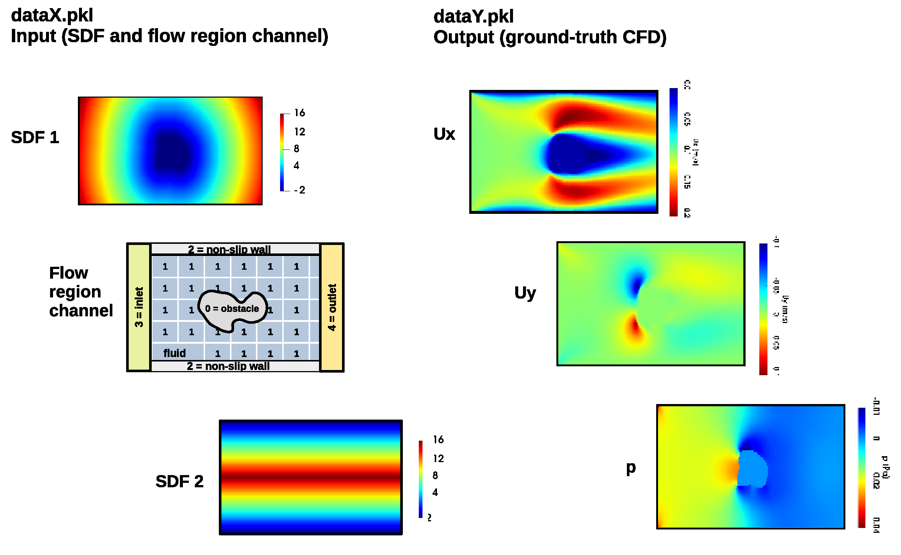
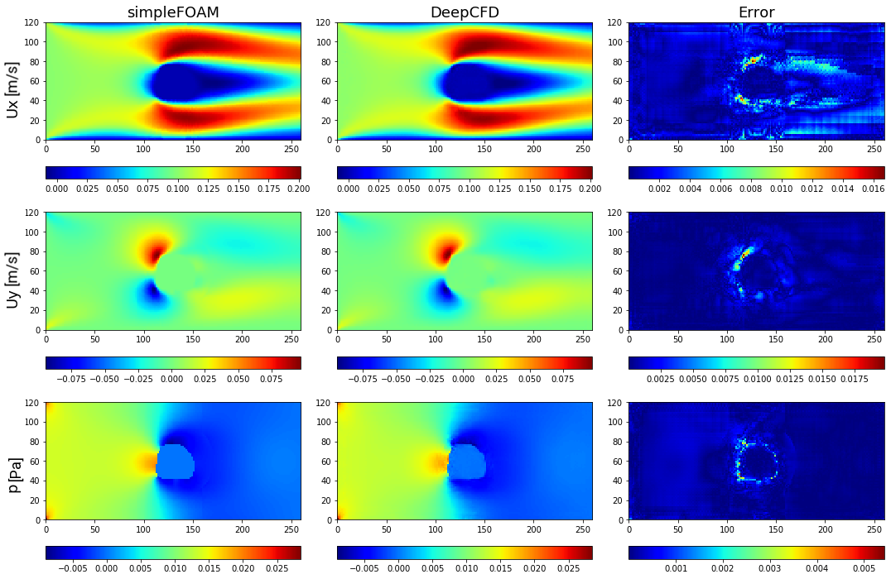
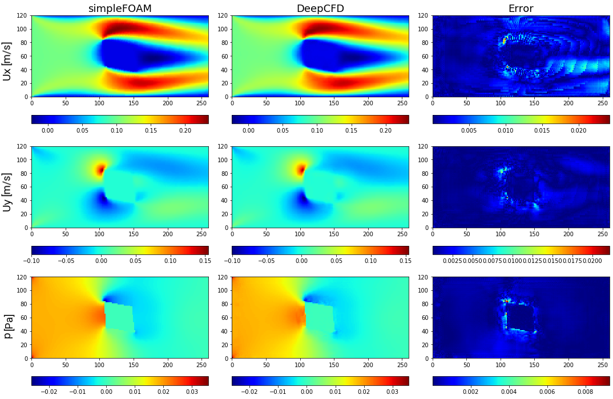
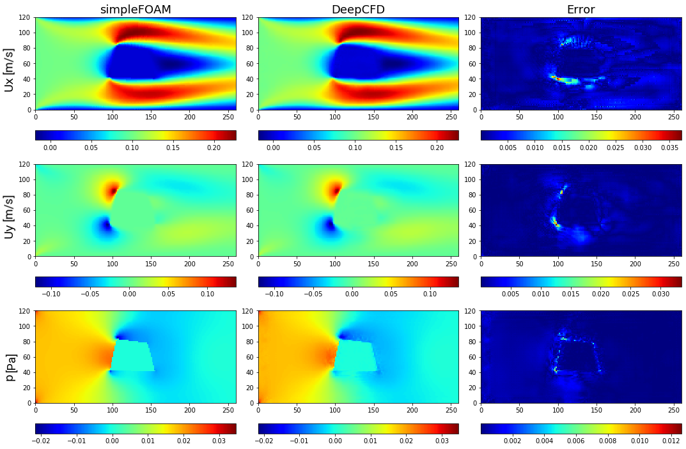
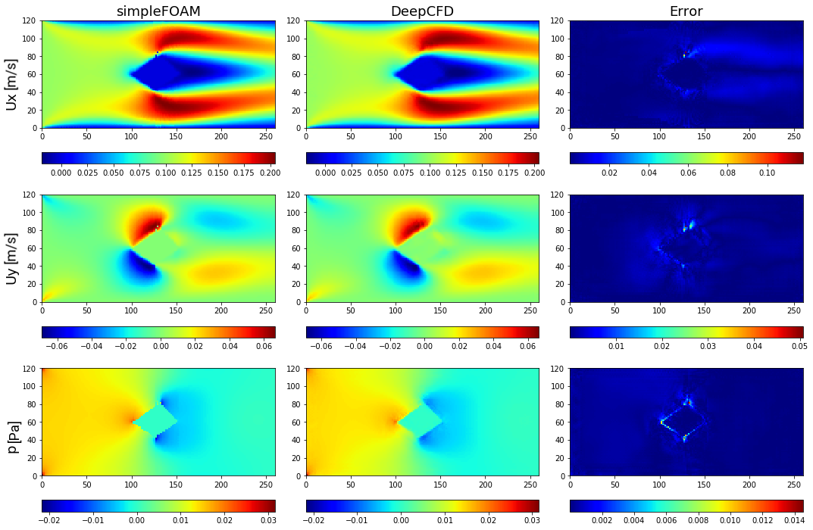
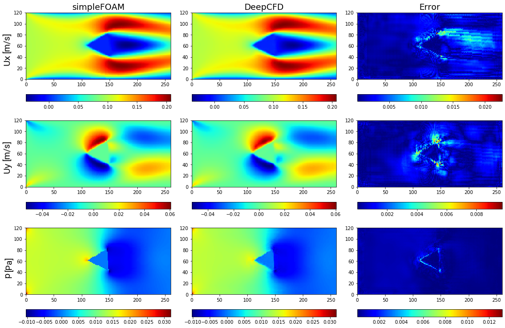
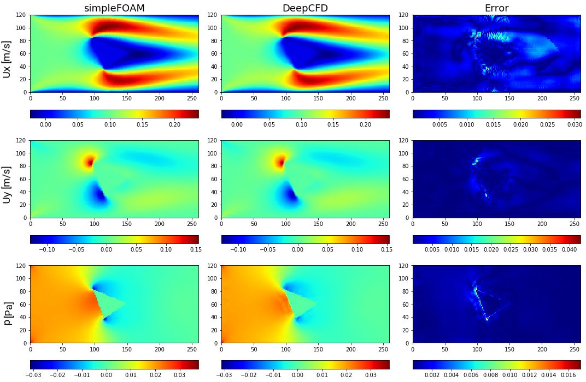
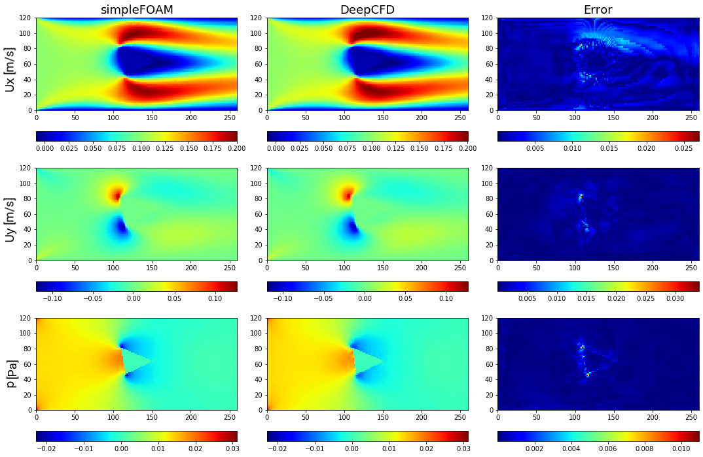

# DeepCFD

Computational Fluid Dynamics (CFD) simulation by the numerical solution of the Navier-Stokes equations is an essential tool in a wide range of applications from engineering design to climate modeling. However, the computational cost and memory demand required by CFD codes may become very high for flows of practical interest, such as in aerodynamic shape optimization. This expense is associated with the complexity of the fluid flow governing equations, which include non-linear partial derivative terms that are of difficult solution, leading to long computational times and limiting the number of hypotheses that can be tested during the process of iterative design. Therefore, we propose DeepCFD: a convolutional neural network (CNN) based model that efficiently approximates solutions for the problem of non-uniform steady laminar flows. The proposed model is able to learn complete solutions of the Navier-Stokes equations, for both velocity and pressure fields, directly from ground-truth data generated using a state-of-the-art CFD code. Using DeepCFD, we found a speedup of up to 3 orders of magnitude compared to the standard CFD approach at a cost of low error rates.

Paper: https://arxiv.org/abs/2004.08826

---

## Dataset and Code

A toy dataset and the code for this project can be downloaded using the following https://zenodo.org/record/3666056/files/DeepCFD.zip?download=1

The folder includes the files dataX and dataY, in which the first file provides the input information on the geometry of 981 channel flow samples, whereas the dataY file provides their ground-truth CFD solution for the velocity (Ux and Uy) and thepressure (p) fields using the simpleFOAM solver. Figure 1 describes the structure of each of these files in detail:

> Figure 1. DeepCFD toy dataset structure.

Both dataX/dataY have the same dimensions (Ns, Nc, Nx, Ny), in which the first axis is the number of samples (Ns), the second axis is the number of channels (Nc), and third and fourth axes are the number of elements in x and y (Nx and Ny). Regarding the input dataX, the first channel is the SDF calculated from the obstacle's surface, the second channel is the multi-label flow region channel, and the third channel is the SDF from the top/bottom surfaces. For the output dataY file, the first channel is the Ux horizontal velocity component, the second channel is the Uy vertical velocity component, and the third channel is the pressure field.

An example of how to train the DeepCFD model using the settings described in the paper is provided in the "DeepCFD.py" script. A few useful functions are provided in the "functions.py" file, such as a plotting function to visualize the outcome of the model. Moreover, templates with all networks investigated in this study can be found in the folder "Models", including both "AutoEncoder" and "UNet" architecture types with one or multiple decoders.

## Flow Visualization Plots - OpenFOAM vs DeepCFD

> Figure 2. Comparison between ground-truth CFD (simpleFOAM) and DeepCFD prediction, showing both velocity components, and pressure fields, as well as absolute error in flow around circle based shape 1.

> Figure 3. Comparison between ground-truth CFD (simpleFOAM) and DeepCFD prediction, showing both velocity components, and pressure fields, as well as absolute error in flow around circle based shape 2.

> Figure 4. Comparison between ground-truth CFD (simpleFOAM) and DeepCFD prediction, showing both velocity components, and pressure fields, as well as absolute error in flow around square based shape 1.

> Figure 5. Comparison between ground-truth CFD (simpleFOAM) and DeepCFD prediction, showing both velocity components, and pressure fields, as well as absolute error in flow around square based shape 2.

> Figure 6. Comparison between ground-truth CFD (simpleFOAM) and DeepCFD prediction, showing both velocity components, and pressure fields, as well as absolute error in flow around rhombus based shape 1.

> Figure 7. Comparison between ground-truth CFD (simpleFOAM) and DeepCFD prediction, showing both velocity components, and pressure fields, as well as absolute error in flow around rhombus based shape 2.

> Figure 8. Comparison between ground-truth CFD (simpleFOAM) and DeepCFD prediction, showing both velocity components, and pressure fields, as well as absolute error in flow around forward-facing triangle based shape 1.

> Figure 9. Comparison between ground-truth CFD (simpleFOAM) and DeepCFD prediction, showing both velocity components, and pressure fields, as well as absolute error in flow around forward-facing triangle based shape 2.

> Figure 10. Comparison between ground-truth CFD (simpleFOAM) and DeepCFD prediction, showing both velocity components, and pressure fields, as well as absolute error in flow around backward-facing triangle based shape 1.

> Figure 11. Comparison between ground-truth CFD (simpleFOAM) and DeepCFD prediction, showing both velocity components, and pressure fields, as well as absolute error in flow around backward-facing triangle based shape 2.

## DeepCFD architecture

Figure 12 shows a schematic representation of the DeepCFD architecture:

> Figure 12. DeepCFD U-Net Architecture.

Further hyper-parameters used are provided in Table 1:

> Table 1. DeepCFD hyper-parameters.

| Parameter     | Value         | 
| ------------- |--------------:|
| Learning rate | 1e-3          | 
| Kernel size   | 5             | 
| Filters       | [8,16,32,32]  | 
| Batch size    | 64            | 
| Weight decay  | 0.005         | 
| Batch norm    | off           | 
| Weight norm   | off           | 

